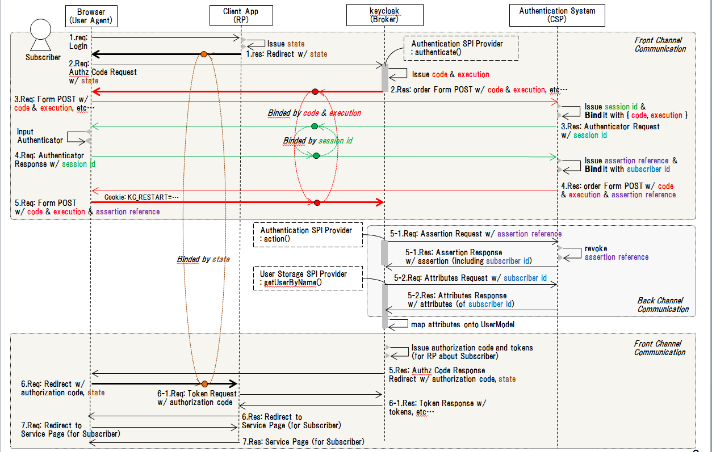

Authentication Delegation Mechanism Design Memo
===

# 1. Preface
This memo describes Authentication Delegation Mechanism realized by keycloak's SPI Providers.
In this memo, the terms defined in [NIST SP 800-63C] are used.

## 1.1. Reference
[NIST SP 800-63C] [DRAFT NIST Special Publication Digital Identity Guidelines 800-63C Federation and Assertion](https://pages.nist.gov/800-63-3/sp800-63c.html "DRAFT NIST Special Publication Digital Identity Guidelines 800-63C Federation and Assertion")

[keycloak] [Keycloak Server Administration Guide](https://keycloak.gitbooks.io/documentation/server_admin/index.html)

[SAMLv2] [Security Assertion Markup Language(SAML) V2.0 Technical Overview](https://www.oasis-open.org/committees/download.php/27819/sstc-saml-tech-overview-2.0-cd-02.pdf)

[TokenBind] [The Token Binding Protocol Version 1.0](https://tools.ietf.org/html/draft-ietf-tokbind-protocol-14)

[SAMLv2HoKA] [SAML V2.0 Holder-of-Key Assertion Profile Version 1.0 Committee Specification 02](http://docs.oasis-open.org/security/saml/Post2.0/sstc-saml2-holder-of-key-cs-02.pdf)

[PKCE] [RFC 7636 Proof Key for Code Exchange by OAuth Public Clients](https://tools.ietf.org/html/rfc7636)

[OWASP] [Session Management Cheat Sheet](https://www.owasp.org/index.php/Session_Management_Cheat_Sheet)

## 1.2. About Authentication Delegation
Authentication Delegation stands for delegating authentication to an external authentication server on behalf of keycloak's browser-based authentication mechanism. It might be said that it be the variant of Identity Brokering mentioned in section 3.13 of [keycloak] except for not using standard protocols for Identity Federation such as OpenID Connect and SAMLv2. Its concept is similar to 5.1.3 SP-Initiated SSO: POST/Artifact Bindings of [SAMLv2].

## 1.3. Current Status
Prototype Implementation and PoV testing has been completed.

## 1.4. Implementation Concept
Implementing as additional providers and its factories for Authentication SPI and User Storage SPI in order to avoid impairing existing keycloak features.

# 2. Motivation
- The authentication server has already existed.
- This authentication server has not implemented OpenID Connect protocol.
- You want to use keycloak for realizing secure identity and access management by OpenID Connect.

In this situation above, you could opt to port the authentication feature of the existing authentication server onto keycloak and use User Storage SPI provider for retrieving user information from the existing authentication server, or implementing OpenID Connect protocol to address Identity Brokering triggered by keycloak.

However, the followings make it hard or impossible. 

- UI implementation cost : Responsive design, vast amount of customization based on various factors.
- Authentication porting cost : Requirements for high-level authentication that have already been implemented in the existing authentication server such as multi-factor authentication for LoA 3 conformance in ITU-T X.1254.

This authentication delegation mechanism resolves these difficulties by using the existing authentication server for authentication and retrieving authenticated user information by back-end communication between keycloak and the existing authentication server.

## 3. Protocol Flow

1. On authentication, keycloak(**Broker**) direct an end user's browser(**User-Agent**) to the existing authentication server(**CSP**).

2. After successful authentication, **CSP** sends **Assertion Reference** to **Broker** indirectly via **User-Agent** in **Front Channel Communication**. 

3. After receiving **Assertion Reference**, **Broker** resolves **Assertion Reference** by sending **Assertion Reference** to **CSP** directly in **Back Channel Communication**.

4. After receiving **Assertion** including **Subscriber's ID**, **Broker** gets subscriber's **Attributes** by sending **Subscriber's ID** to **CSP** directly in **Back Channel Communication**.

5. After receiving **Attributes**, **Broker** maps **Attributes** onto local representation of user, namely keycloak's UserModel.

While my Authentication SPI Provider does tasks through 1 to 3, my User Storage SPI Provider does tasks in 4 and 5.

</img>

## 4. Open Issues

## 4.1. Prerequisite for the Existing Authentication Server(CSP)

Need to consider CSP's interface of each Front and Back Channel Communication in order for this mechanism to cover various CSP.

## 4.2. Security Consideration

I've consider them based on 6.1. Back-channel Presentation and 8. Security of [NIST SP 800-63C].

### 4.2.1. Assertion
In general, there seemed to be nothing special because assertions are transmitted in Back Channel in the private network.

### 4.2.1.1. Assertion Manufacture/Modification
+ Both keycloak's and the external authentication server's endpoints in Back Channel MUST be within the **same private** network so that no entity outside this network can access them, and mutually authenticated TLS connections SHOULD be used if necessary.

### 4.2.1.2. Assertion Disclosure
same as 4.2.1.1.

### 4.2.1.3. Assertion Redirect
same as 4.2.1.1.

### 4.2.1.4. Assertion Substitution
+ Keycloak and the external authentication server MUST be controlled by the same organization.

### 4.2.1.3. Assertion Repudiation
same as 4.2.1.4.

### 4.2.1.4. Assertion Reuse
same as 4.2.1.4.

### 4.2.2. Secondary Authenticator
+ The external authentication server MUST treat uses cases using secondary authenticator.

### 4.2.3. Assertion Reference 
In general, there seemed to take extra precaution because assertion references are transmitted in Front Channel via user's browser in the Internet.

### 4.2.3.1. Assertion Reference Manufacture/Modification
+ Both keycloak's and the external authentication server's endpoints in Front Channel MUST NOT accept HTTP connection but MUST only accept HTTPS connections.
+ Assertion reference MUST NOT contain any information about an authenticated user and MUST be created with at least 256 bits of entropy

### 4.2.3.2. Assertion Reference Disclosure
+ same as the first item mentioned in 4.2.3.1.
+ Assertion reference MUST NOT be carried as query string and fragment of URI 

### 4.2.3.3. Assertion Reference Redirect
+ Redirection URI to which an assertion reference is conveyed MUST be specified by the external authentication server

### 4.2.3.4. Assertion Reference Substitution
Besides assertion reference, if an attacker intercept a victim's login session information (aka code issued by keycloak's endpoint in Front Channel) and the assertion reference, the attacker impersonate the victim by accessing keycloak's login endpoint in Front Channel with victim's session information(code) and assertion reference.

In order to prevent this impersonation, several methods are developed.
1. Token Binding using TLS layer's exported keying material derived from its master secret mentioned in [TokenBind]
2. Holder of Key Assertion mentioned in [SAMLv2HoKA]
3. Proof Key for Code Exchange mentioned in [PKCE]
4. Session ID in Cookie, header parameter mentioned in [OWASP]

Apart from 1, if the attacker intercepts messages between the victim's browser and keycloak, and between victim's browser and the external authentication server, the attacker has a chance to impersonate the victim. Therefore, communications among them MUST be protected by TLS which makes the attacker given little chance to intercept messages (but not perfect if considering MITM, compromising user's browser and machine, et al.).

As for 1, it is preferable but I couldn't find any implementation that might be used.

As for 2, it might be difficult to use and manage client side X.509 certificates.

As for 3, it might be difficult to make the browser conduct this protocol without modifying the browser itself (might be possible if using JavaScript sent from keycloak).

Therefore, I chose 4 and use HTTP FORM POST with assertion reference enclosed in its message's body, but not yet determine whether using cookie or header parameter for Session ID.

In keycloak, code issued from login endpoint in Front Channel would be used as session id, but I did not use it as Session ID because keycloak's default login endpoint only accept code (and execution) in the form of query parameters, which might not be secure because query parameters are disclosed in the browser, the http/proxy server's log and so on.

### 4.2.3.5. Assertion Reference Reuse
+ Assertion reference MUST be available in a short time such as 30 seconds (might be enough long to complete assertion resolution because of what mentioned in 4.2.1.1. and 4.2.1.4.).
+ Assertion reference MUST be used once and for all.

### 4.2.3.6. Assertion Reference Repudiation
same as 4.2.1.4.

## 4.3. Role (Scope) Mapping
As proposal, determine roles(scopes) assigned to users as Cartesian product of the following sets.
+ Values sent from the external authentication server
+ Values assigned users as "Default Roles"
+ Values specified in "scope" OAuth2/OIDC protocol parameter

Currently, not yet implemented.

I'm not sure how to deal with client role and realm role differently.

## 4.4. Supporting Multiple External Authentication Server
Not support multiple external authentication servers.

## 4.5. How to Incorporate Who Authenticated Subject in ID Token
TBD

(add non-standard claim, or standard claim exists? I'll consult keycloak's identity brokering implementation and follow them.)

## 4.6. Cache Policy
TBD

## 4.7. Error Handling
TBD

