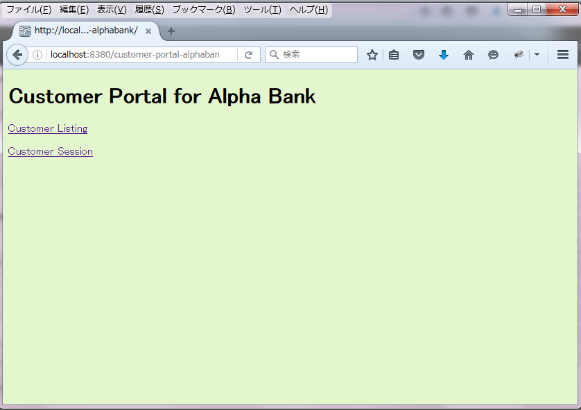
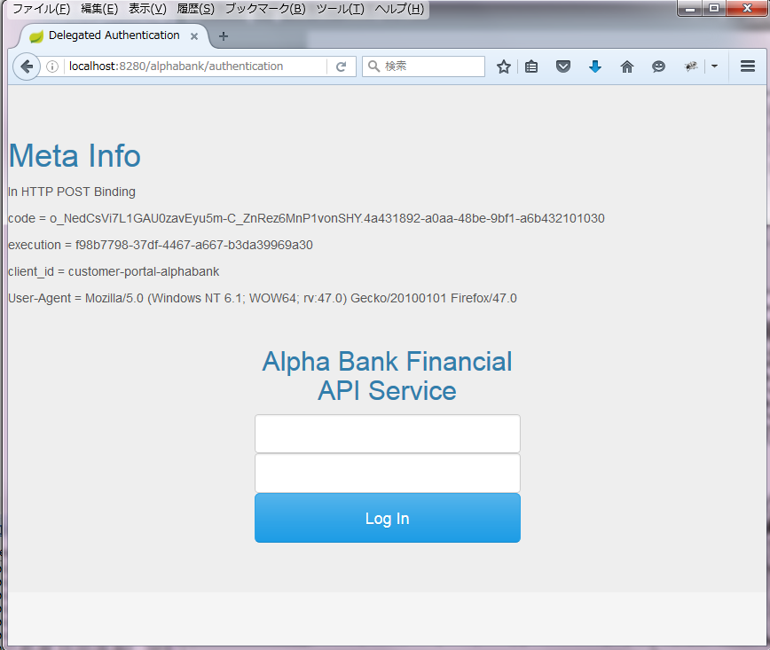
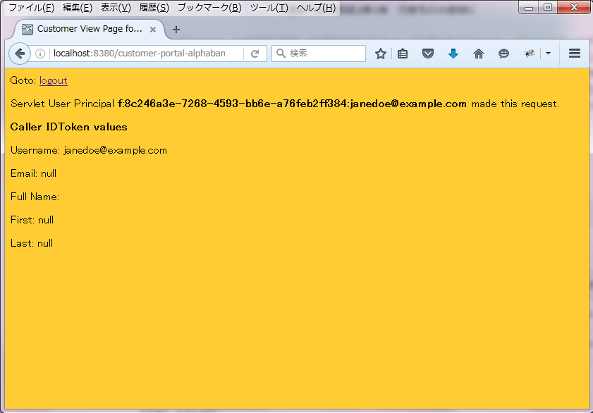
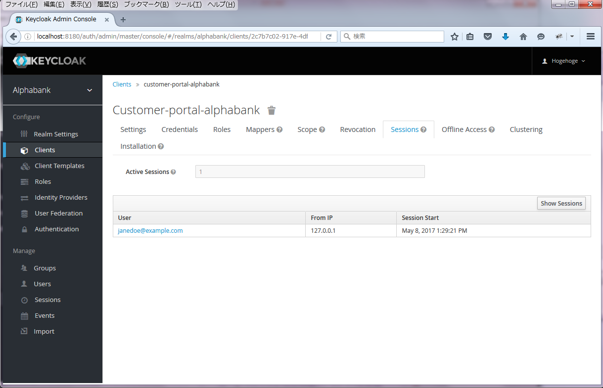
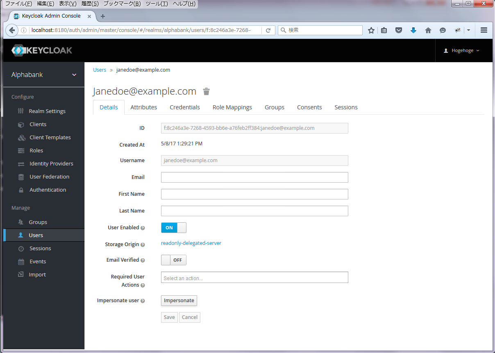
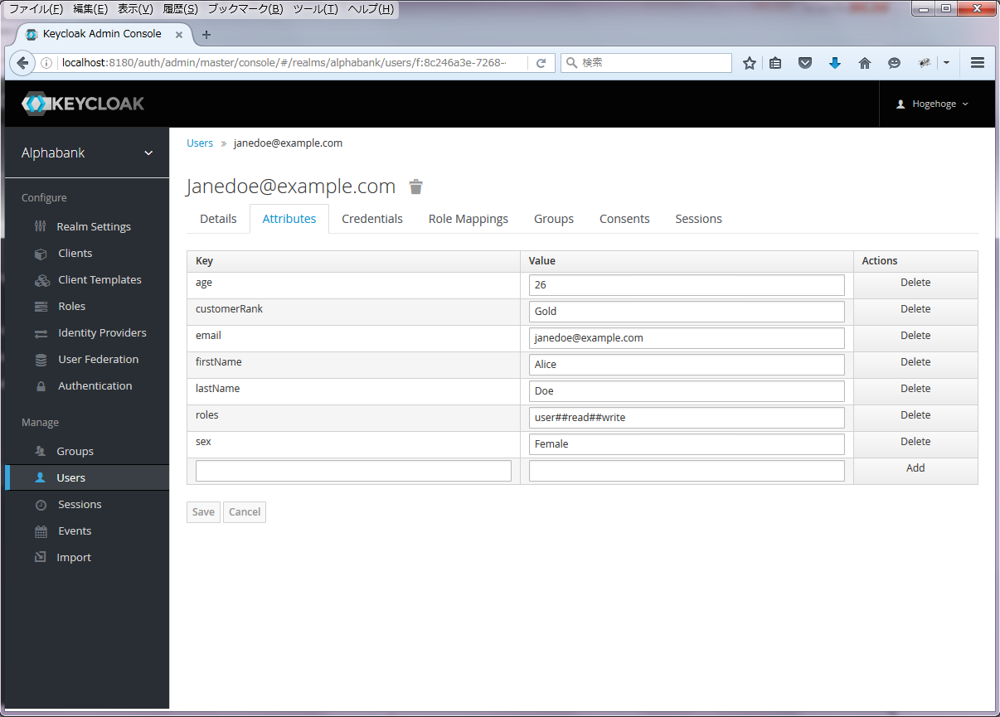
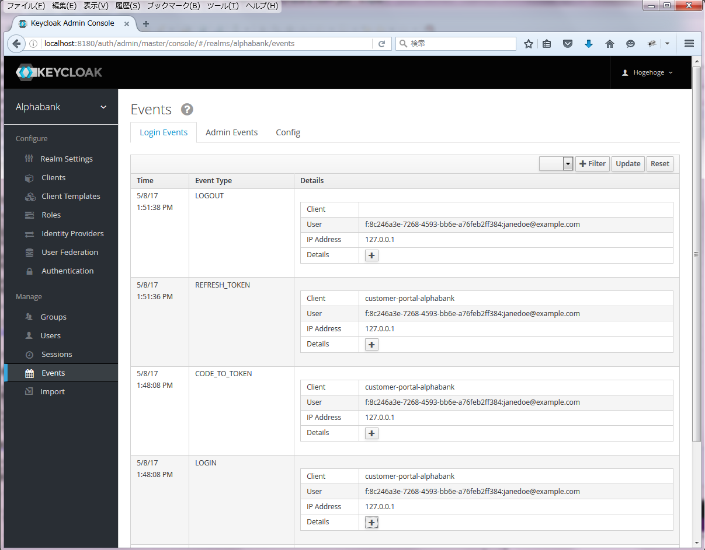

How to try on the sample Authentication Delegation implementation
===

# 1. Overview
1. For keycloak, build and install the each sample of Authentication/User Storage Providers and its factories.

2. For Client, build the sample client and run it on wildfly.

3. For External Authentication Server, build the sample external authentication server and run it as standalone server.

4. On the client, invoke OIDC authorization code flow.

5. Login on the external authentication server, and confirm the authentication result on the client.

# 2. Setup
This section shows how to setup each components of this sample.

The layout of this sample is as follows.

\- /ExternalAuthenticationServer

: Spring Boot project of the sample External Authentication Server

\- /keycloak

: Including the sample providers and client based on keycloak-2.5.1.Final

\-- /examples/demo-template/customer-app-alphabank

: The sample client based on customer-app example project

\-- /examples/providers/authenticator

: The sample Authentication Provider and its Factory

\-- /examples/providers/user-storage-simple

: The sample User Storage Provider and its Factory

\- /supplements

: Including documents such as showing the sequence diagram to help you understand this sample.

## 2.1. Client
This sample client must run on **port 8380**.

Run wildfly 10 by `standalone.xml -Djboss.socket.binding.port-offset=300`

Copy and overwrite /examples/demo-template onto keycloak-2.5.1.Final or later, and `mvn clean package` and deploy `customer-portal-alphabank.war` onto wildfly 10.

## 2.2. External Authentication Server
This sample external authentication server must run on **port 8280**.

Build and run PseudoServerApplication.java as java application and on port 8280.

## 2.3. keycloak
This keycloak must run on **port 8180**.

Run keycloak by `standalone.xml -Djboss.socket.binding.port-offset=100`

### 2.3.1. Realm

Login keycloak as admin user.

Add realm -> Import

Choose `alphabank-realm.json` enclosed in the sample client.

-> Create

### 2.3.2. Roles

Roles -> Default Roles -> Realm Roles -> Available Roles

select "user"

-> Add selected

### 2.3.3. Events

Events -> Config

-> Login Events Settings

Save Events :

ON

Saved Types :

LOGIN

LOGIN_ERROR

LOGOUT

LOGOUT_ERROR

CODE_TO_TOKEN

CODE_TO_TOKEN_ERROR

REFRESH_TOKEN

REFRESH_TOKEN_ERROR

INTROSPECT_TOKEN

INTROSPECT_TOKEN_ERROR

EXECUTE_ACTIONS

EXECUTE_ACTIONS_ERROR

-> Admin Events Settings

Save Events :

ON

Include Representation :

ON

-> Save

### 2.3.4. Authentication SPI Provider

Authentication -> Flows -> New

Alias :

External Authentication Server

-> Save

-> Add Execution

Provider :

Authentication Delegation

-> Save

Required :

On

-> Actions -> Config

Alias : 

ExternalAuthenticationServer

External Authentication Server Authentication URI :

http://localhost:8280/alphabank/authentication

External Authentication Server Authenticated User ID Endpoint :

http://localhost:8280/alphabank/userid

HTTP FORM POST for forwarding parameters :

ON

-> Save

Authentication -> Bindings

Browser Flow :

External Authentication Server

-> Save

### 2.3.5. User Storage SPI Provider

User Federation

Add provider... :

readonly-delegated-server

Priority :

0

External Authentication Server User Information URI :

http://localhost:8280/alphabank/userinfo

Cache Policy :

MAX_LIFESPAN

Max Lifespan :

5000

# 3. PoV trial

By your browser, access the sample client in

http://localhost:8380/customer-portal-alphabank/

</img>

Click "Customer Listing", and confirm that the external authentication page shows.

</img>

Click "Login", and confirm that the client page after logged in shows.

</img>

On keycloak, confirm that the user authenticated by the external authentication is logged in.

</img>

</img>

</img>

On the sample client, Click "Logout", and confirm that the user authenticated by the external authentication is logged out.

</img>

On capturing packets, check out the contents of the access token.

```json
{
  "jti":"5bf2488f-07ca-471f-af90-dd75221da59e",
  "exp":1493717485,
  "nbf":0,
  "iat":1493717425,
  "iss":"http://localhost:8180/auth/realms/alphabank",
  "aud":"customer-portal-alphabank",
  "sub":"f:8c246a3e-7268-4593-bb6e-a76feb2ff384:janedoe@example.com",
  "typ":"Bearer",
  "azp":"customer-portal-alphabank",
  "auth_time":1493717425,
  "session_state":"9d5154a3-e2aa-4390-b6dc-0c181482bfb2",
  "acr":"1",
  "client_session":"6527a6e1-9aba-4e4d-b3f2-bd057e504b39",
  "allowed-origins":[],
  "realm_access":{"roles":["read","uma_authorization","user","write"]},
  "resource_access":{"account":{"roles":["manage-account","view-profile"]}},
  "firstName":"Alice",
  "lastName":"Doe",
  "customerRank":"Gold",
  "sex":"Female",
  "name":"",
  "scopes":"[read, offline_access, uma_authorization, user, write]",
  "preferred_username":"janedoe@example.com",
  "age":"26"
}
```
