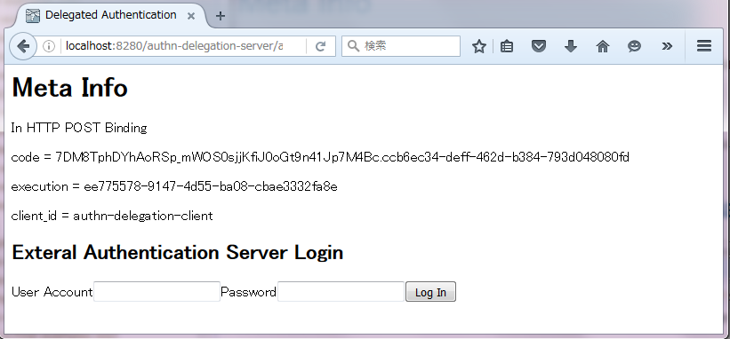
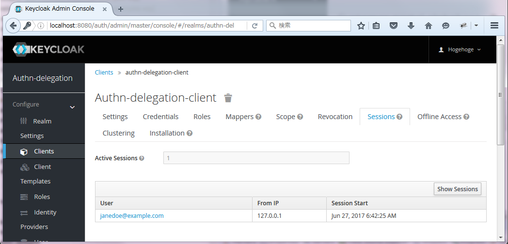
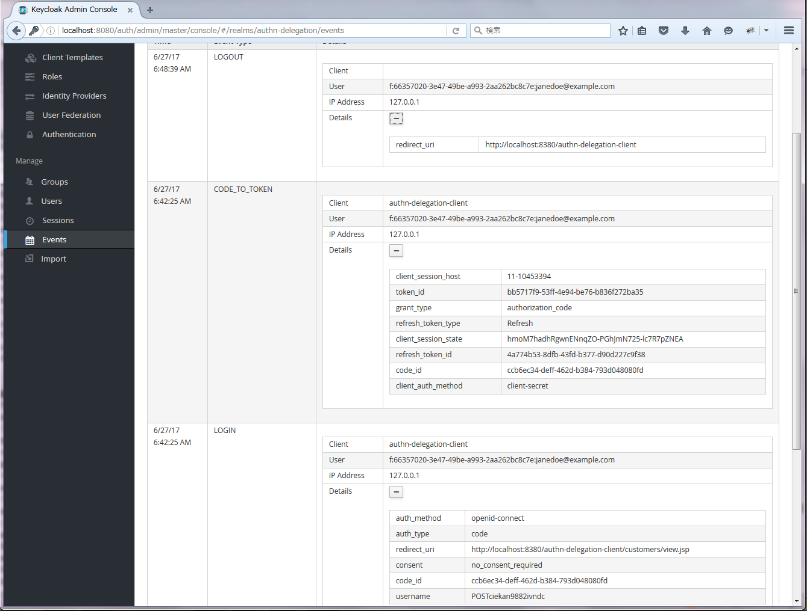

Authentication Delegation Example with Authentication Provider and User Storage Provider
===================================
In this context, Authentication Delegation stands for delegating authentication to an existing external authentication server on behalf of keycloak's browser-based authentication mechanism. It might be said that it be the variant of Identity Brokering except for not using standard protocols for Identity Federation such as OpenID Connect and SAMLv2.

This example consists of three components.

* **providers** : Authentication Provider and User Storage Provider.
* **authn-server** : An external authentication server to which keycloak delegates authentication.
* **client** : A client application.

In this example, each of keycloak, authn-server, and client runs on each different wildfly server.

* **keycloak** : runs on port 8080
* **authn-serer** : runs on port 8280
* **client** : runs on port 8380

After completing mvn install, please deploy each .jar and .war in target directory onto each corresponding wildfly server.

On keycloak's admin console, please load authn-delegation-realm.json for realm settings for this example.

After that, access [http://localhost:8380/authn-delegation-client/](http://localhost:8380/authn-delegation-client/)

# PoV trial

By your browser, access the sample client in

http://localhost:8380/authn-delegation-client/

</img>

Click "Service Here", and confirm that the external authentication page shows.

</img>

Click "Log In", and confirm that the client page after logged in shows.

</img>

On keycloak, confirm that the user authenticated by the external authentication is logged in.

</img>

</img>

</img>

On the sample client, Click "Logout", and confirm that the user authenticated by the external authentication is logged out.

</img>

On capturing packets, check out the contents of the access token.

```json
{
  "jti":"bb5717f9-53ff-4e94-be76-b836f272ba35",
  "exp":1498513645,
  "nbf":0,
  "iat":1498513345,
  "iss":"http://localhost:8080/auth/realms/authn-delegation",
  "aud":"authn-delegation-client",
  "sub":"f:66357020-3e47-49be-a993-2aa262bc8c7e:janedoe@example.com",
  "typ":"Bearer",
  "azp":"authn-delegation-client",
  "auth_time":1498513345,
  "session_state":"a07a76c6-d995-4ea6-9ad6-504c5387ef1a",
  "acr":"1",
  "client_session":"ccb6ec34-deff-462d-b384-793d048080fd",
  "allowed-origins":[],
  "realm_access":
    {
      "roles":["uma_authorization","user"]
    },
  "resource_access":
    {
      "account":
        {
          "roles":["manage-account","manage-account-links","view-profile"]
        }
     },
  "firstName":"Jane",
  "lastName":"Doe",
  "customerRank":"Gold",
  "sex":"Female",
  "name":"",
  "delegated_amr":"TwoFactorBiometricsPassword",
  "scopes":["read_account","write_account"],
  "preferred_username":"janedoe@example.com",
  "delegated_authenticator":"http://localhost:8280/authn-delegetion-server/authenticate",
  "delegated_acr":"3",
  "email":"janedoe@example.com",
  "age":"26"
}

